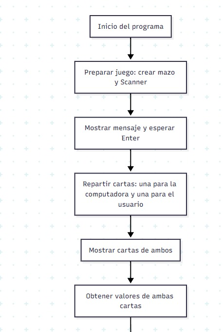
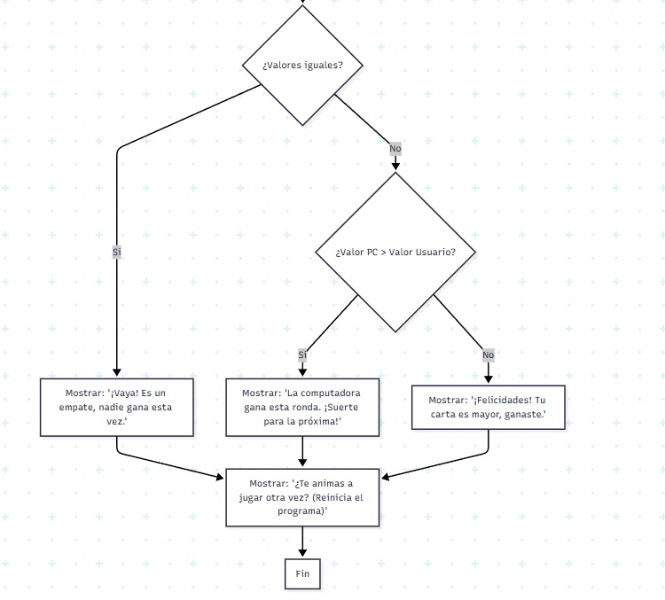
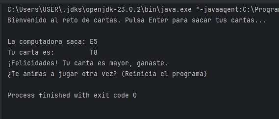

# Juego de Cartas en Java

## Descripción General
Este proyecto implementa un sencillo juego de cartas en Java, donde el usuario compite contra la computadora. Cada uno recibe una carta al azar de un mazo completo, y el ganador es quien tenga la carta de mayor valor. Si ambos tienen el mismo valor, es un empate.

## ¿Cómo funciona el código?
1. **Preparación:** Se crea un mazo de cartas (mezclado aleatoriamente) y se prepara la entrada por teclado.
2. **Reparto:** Se reparten dos cartas, una para la computadora y otra para el usuario.
3. **Comparación:** Se comparan los valores de ambas cartas.
4. **Resultado:** Se muestra quién ganó, si hubo empate, y se invita a jugar de nuevo.

## Estructura del Código

### Enum `Suit`
Un `enum` (enumeración) es un tipo especial de clase en Java que representa un conjunto fijo de constantes. En este caso, `Suit` representa los palos de la baraja:
- TREBOL (T)
- DIAMANTES (D)
- CORAZONES (C)
- ESPADAS (E)

### Enum `Valor`
Otro `enum` que representa los valores posibles de una carta: 2-10, J, Q, K, A. Cada valor tiene asociado un número para poder comparar cuál es mayor.

### Clase `Card`
Representa una carta individual. Es inmutable (no se puede cambiar una vez creada) y tiene dos atributos: el palo (`Suit`) y el valor (`Valor`).

### Clase `Deck`
Representa el mazo de cartas. Al crearse, genera todas las combinaciones posibles de palos y valores, y las mezcla aleatoriamente. Permite sacar cartas una a una.

### Clase `Main`
Contiene el método principal (`main`). Aquí se ejecuta el flujo del juego: se crea el mazo, se reparten las cartas, se comparan y se muestra el resultado.

## Diagrama de Flujo

## Ejemplo de Salida

## ¿Qué es un Enum?
Un `enum` en Java es una forma de definir un conjunto de constantes con nombre. Es útil cuando tienes un grupo fijo de valores posibles, como los palos o valores de una baraja. Los enums ayudan a que el código sea más claro y seguro, evitando errores por valores inválidos.

## ¿Qué es una Clase?
Una clase es una plantilla para crear objetos en Java. Define atributos (datos) y métodos (acciones). En este proyecto, las clases principales son `Card`, `Deck` y la clase principal `Main`.

## ¿Cómo jugar?
1. Ejecuta el programa.
2. Pulsa Enter cuando se te pida.
3. Observa las cartas y el resultado.
4. Si quieres jugar de nuevo, reinicia el programa.

---
